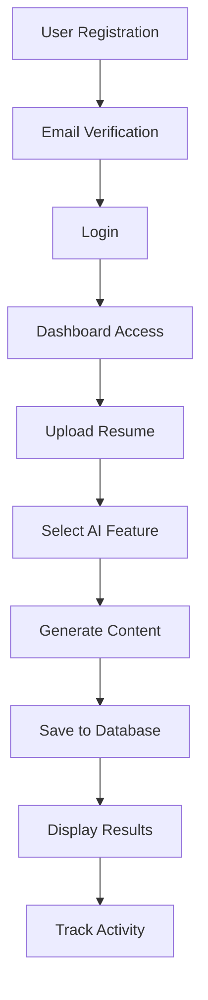

# Applyo - AI-Powered Job Application Assistant

<div align="center">


[](https://nextjs.org/)
[](https://react.dev/)
[](https://supabase.com/)
[](https://www.typescriptlang.org/)
[](https://tailwindcss.com/)
[](https://deepmind.google/technologies/gemini/)

**A comprehensive AI-powered platform that streamlines your job search process with intelligent resume optimization, cover letter generation, ATS analysis, and automated application tracking.**

[Features](#-features) • [Getting Started](#-getting-started) • [Architecture](#-architecture) • [Documentation](#-documentation) • [Contributing](#-contributing)

</div>

---

## 📋 Table of Contents

- [Overview](#-overview)
- [Features](#-features)
- [Technology Stack](#-technology-stack)
- [Getting Started](#-getting-started)
- [Project Structure](#-project-structure)
- [System Architecture](#-system-architecture)
- [Database Schema](#-database-schema)
- [API Documentation](#-api-documentation)
- [Key Features Deep Dive](#-key-features-deep-dive)
- [Security](#-security)
- [Performance](#-performance)
- [Deployment](#-deployment)
- [Contributing](#-contributing)
- [License](#-license)

---

## 🎯 Overview

**Applyo** is an AI-powered job application assistant platform designed to help job seekers optimize their application materials and streamline their job search process. Leveraging Google's Gemini AI, Applyo provides a comprehensive suite of tools for resume improvement, cover letter generation, ATS optimization, and application management.

### 🎪 Core Purpose

- **Primary Goal**: Help job seekers create better resumes, cover letters, and application materials using AI
- **Target Users**: Early-career professionals and active job seekers
- **Key Differentiator**: Comprehensive suite of AI tools integrated with job tracking and auto-apply features

### ✨ Why Applyo?

- 🤖 **AI-Powered Intelligence**: Leverages Google Gemini 2.0 for sophisticated content generation
- 📊 **ATS Optimization**: Ensures your resume passes Applicant Tracking Systems
- 🎯 **Personalized Results**: Tailored suggestions based on your profile and target roles
- 📈 **Progress Tracking**: Monitor your application journey with built-in tracking tools
- 🔒 **Secure & Private**: Your data is protected with enterprise-grade security

---

## 🚀 Features

### 🧠 Core Intelligence Features

| Feature | Description |
|---------|-------------|
| **AI Resume Improver** | Transform your resume with AI-powered enhancements, improving clarity, impact, and keyword optimization |
| **Cover Letter Generator** | Create personalized, compelling cover letters tailored to specific job descriptions |
| **ATS Score Checker** | Analyze your resume's compatibility with Applicant Tracking Systems (0-100 score) |
| **ATS Score Improver** | Get actionable recommendations to improve your ATS compatibility |
| **Job-Resume Comparison** | Evaluate how well your resume matches specific job requirements |
| **Skill Gap Finder** | Identify missing skills and get learning path suggestions |
| **Interview Question Generator** | Prepare for interviews with AI-generated questions and suggested answers |

### 📊 Job Application Tools

- **Job Finder**: AI-powered job search with intelligent matching
- **Job Tracker**: Comprehensive application tracking and management
- **Job Validity Checker**: Verify job posting legitimacy to avoid scams
- **Auto-Applier**: Streamline applications with automated submission (coming soon)

### 👤 Account Management

- **User Profile**: Manage your professional information and preferences
- **Activity Log**: Track all your AI generations and actions
- **Settings**: Customize your experience

---

## 🛠 Technology Stack

### Frontend

```json
{
  "framework": "Next.js 16.0.0 (App Router + Turbopack)",
  "ui": "React 19.2.0",
  "styling": "Tailwind CSS 4.1.9",
  "components": "Radix UI (shadcn/ui)",
  "icons": "Lucide React",
  "forms": "React Hook Form + Zod",
  "charts": "Recharts",
  "pdf": "pdfjs-dist 5.4.394"
}
```

### Backend

```json
{
  "runtime": "Next.js API Routes",
  "auth": "Supabase Auth",
  "database": "Supabase (PostgreSQL)",
  "ai": "Google Gemini 2.0 Flash Exp",
  "storage": "Supabase Storage"
}
```

### Development

```json
{
  "language": "TypeScript 5",
  "package_manager": "npm",
  "linting": "ESLint",
  "build_tool": "Turbopack"
}
```

---

## 🏁 Getting Started

### Prerequisites

- **Node.js** 18.x or higher
- **npm** or **yarn**
- **Supabase Account** ([Sign up here](https://supabase.com))
- **Google Gemini API Key** ([Get it here](https://ai.google.dev))

### Installation

1. **Clone the repository**

```bash
git clone https://github.com/yourusername/applyo.git
cd applyo
```

2. **Install dependencies**

```bash
npm install --legacy-peer-deps
```

3. **Set up environment variables**

Create a `.env.local` file in the root directory:

```env
# Supabase Configuration
NEXT_PUBLIC_SUPABASE_URL=https://your-project.supabase.co
NEXT_PUBLIC_SUPABASE_ANON_KEY=your-anon-key-here
SUPABASE_SERVICE_ROLE_KEY=your-service-role-key-here

# Google Gemini API
GEMINI_API_KEY=your-gemini-api-key-here
```

4. **Set up the database**

Run the SQL scripts in your Supabase SQL Editor (in order):

```bash
# 1. Main schema
scripts/schema.sql

# 2. Schema additions
scripts/schema_additions.sql

# 3. Latest updates
scripts/schema_v2_additions.sql
```

5. **Run the development server**

```bash
npm run dev
```

6. **Open your browser**

Navigate to [http://localhost:3000](http://localhost:3000)

### First-Time Setup

1. **Create an account** at `/auth/sign-up`
2. **Verify your email** (check your inbox)
3. **Log in** at `/auth/login`
4. **Upload your resume** on the dashboard
5. **Start using AI features** 🚀

---

## 📁 Project Structure

```
app-applyo/
├── app/                          # Next.js App Router
│   ├── layout.tsx               # Root layout
│   ├── page.tsx                 # Landing page
│   ├── globals.css              # Global styles & animations
│   │
│   ├── auth/                    # Authentication pages
│   │   ├── login/
│   │   ├── sign-up/
│   │   └── sign-up-success/
│   │
│   ├── dashboard/               # Protected dashboard area
│   │   ├── layout.tsx           # Dashboard layout (Sidebar + Topbar)
│   │   ├── page.tsx             # Dashboard home
│   │   ├── ats-checker/         # ATS Score Checker
│   │   ├── ats-improver/        # ATS Score Improver
│   │   ├── resume-improver/     # AI Resume Improver
│   │   ├── cover-letter/        # Cover Letter Generator
│   │   ├── interview-questions/ # Interview Prep
│   │   ├── job-resume-compare/  # Job-Resume Matcher
│   │   ├── skill-gap-finder/    # Skill Gap Analysis
│   │   ├── job-finder/          # Job Search
│   │   ├── job-tracker/         # Application Tracker
│   │   ├── job-validity/        # Job Listing Validator
│   │   ├── auto-applier/        # Auto-Apply System
│   │   ├── profile/             # User Profile
│   │   ├── activity/            # Activity Log
│   │   └── settings/            # User Settings
│   │
│   └── api/                     # API Routes
│       ├── core/                # AI Feature APIs
│       │   ├── ats-checker/
│       │   ├── ats-improver/
│       │   ├── resume-improver/
│       │   ├── cover-letter/
│       │   ├── interview-questions/
│       │   ├── job-resume-compare/
│       │   ├── job-finder/
│       │   ├── job-validity/
│       │   └── skill-gap-finder/
│       ├── upload/
│       │   └── resume/          # PDF Upload & Processing
│       ├── items/               # Get generated items
│       └── profile/             # Profile management
│
├── components/                   # React Components
│   ├── sidebar.tsx              # Navigation sidebar
│   ├── topbar.tsx               # Top navigation bar
│   ├── resume-uploader.tsx      # PDF upload component
│   ├── feature-card.tsx         # Feature cards
│   ├── theme-provider.tsx       # Dark mode provider
│   └── ui/                      # UI Component Library
│       ├── button.tsx
│       ├── card.tsx
│       ├── input.tsx
│       ├── textarea.tsx
│       └── ...
│
├── lib/                         # Utility Libraries
│   ├── gemini.ts               # Gemini AI API wrapper
│   ├── supabase/               # Supabase utilities
│   │   ├── client.ts           # Browser client
│   │   ├── server.ts           # Server client
│   │   ├── admin.ts            # Admin client
│   │   ├── middleware.ts       # Auth middleware
│   │   └── ...
│   └── utils/                  # Utility functions
│       ├── pdf-parser.ts       # PDF text extraction
│       ├── gibberish-detector.ts # Content validation
│       ├── validation.ts       # Input validators
│       ├── prompts.ts          # AI prompt templates
│       └── ...
│
├── scripts/                     # Database scripts
│   ├── schema.sql              # Main database schema
│   ├── schema_additions.sql    # Schema updates
│   └── schema_v2_additions.sql # Latest schema changes
│
├── public/                      # Static assets
│   └── pdf.worker.min.mjs      # PDF.js worker
│
└── middleware.ts               # Next.js middleware (auth)
```

---

## 🏗 System Architecture

### High-Level Architecture

```
┌─────────────────────────────────────────────────────────────┐
│                     Client Browser                          │
│  ┌───────────────────────────────────────────────────────┐ │
│  │  Next.js App Router (React 19)                        │ │
│  │  • Pages (Client & Server Components)                 │ │
│  │  • UI Components (Radix UI + Tailwind)                │ │
│  │  • State Management (React Hooks)                     │ │
│  └───────────────────────────────────────────────────────┘ │
└─────────────────────────────────────────────────────────────┘
                           ↕ HTTP/HTTPS
┌─────────────────────────────────────────────────────────────┐
│                   Next.js Server (Edge)                     │
│  ┌───────────────────────────────────────────────────────┐ │
│  │  Middleware Layer                                      │ │
│  │  • Authentication Check (Supabase)                     │ │
│  │  • Session Management                                  │ │
│  │  • Route Protection                                    │ │
│  └───────────────────────────────────────────────────────┘ │
│  ┌───────────────────────────────────────────────────────┐ │
│  │  API Routes (/app/api/*)                              │ │
│  │  • /core/* - AI Feature APIs                          │ │
│  │  • /upload/* - File Upload APIs                       │ │
│  │  • /items - Data Retrieval                            │ │
│  │  • /profile - User Profile Management                 │ │
│  └───────────────────────────────────────────────────────┘ │
└─────────────────────────────────────────────────────────────┘
                ↕                              ↕
┌─────────────────────────┐    ┌───────────────────────────────┐
│   Supabase Backend      │    │   Google Gemini AI API        │
│  • PostgreSQL Database  │    │  • Text Generation            │
│  • Authentication       │    │  • Structured JSON Output     │
│  • Row Level Security   │    │  • Resume/Cover Letter AI     │
│  • Real-time (optional) │    └───────────────────────────────┘
└─────────────────────────┘
```

### Application Flow



---

## 🗄 Database Schema

### Core Tables

#### 1. **profiles** - User Profile Information

```sql
CREATE TABLE profiles (
  id UUID PRIMARY KEY REFERENCES auth.users(id),
  full_name TEXT,
  headline TEXT,
  preferred_tones JSONB DEFAULT '[]',
  created_at TIMESTAMPTZ DEFAULT NOW(),
  updated_at TIMESTAMPTZ DEFAULT NOW()
);
```

**Purpose**: Store additional user information beyond authentication

#### 2. **generated_items** - AI Generated Content

```sql
CREATE TABLE generated_items (
  id UUID PRIMARY KEY DEFAULT gen_random_uuid(),
  user_id UUID REFERENCES auth.users(id) NOT NULL,
  feature TEXT NOT NULL,
  prompt TEXT NOT NULL,
  input_data JSONB,
  result JSONB,
  meta JSONB DEFAULT '{}',
  status TEXT DEFAULT 'done',
  provider TEXT DEFAULT 'gemini',
  cost NUMERIC DEFAULT 0,
  created_at TIMESTAMPTZ DEFAULT NOW(),
  updated_at TIMESTAMPTZ DEFAULT NOW()
);
```

**Purpose**: Central storage for all AI-generated content

**Features Stored**:
- `resume_improver`
- `cover_letter`
- `ats_checker`
- `ats_improver`
- `job_resume_compare`
- `skill_gap_finder`
- `interview_questions`

#### 3. **resumes** - User Resumes

```sql
CREATE TABLE resumes (
  id UUID PRIMARY KEY DEFAULT gen_random_uuid(),
  user_id UUID REFERENCES auth.users(id) NOT NULL,
  title TEXT,
  content TEXT NOT NULL,
  raw_text TEXT,
  word_count INTEGER,
  is_gibberish BOOLEAN DEFAULT FALSE,
  metadata JSONB DEFAULT '{}',
  created_at TIMESTAMPTZ DEFAULT NOW(),
  updated_at TIMESTAMPTZ DEFAULT NOW()
);
```

**Purpose**: Store user's uploaded/created resumes

#### 4. **activity_log** - User Activity Tracking

```sql
CREATE TABLE activity_log (
  id UUID PRIMARY KEY DEFAULT gen_random_uuid(),
  user_id UUID REFERENCES auth.users(id) NOT NULL,
  action TEXT NOT NULL,
  payload JSONB,
  created_at TIMESTAMPTZ DEFAULT NOW()
);
```

**Purpose**: Audit trail of user actions

**Actions Tracked**:
- `generate_resume`
- `generate_cover_letter`
- `check_ats`
- `compare_job_resume`
- `resume_uploaded`

### Security: Row Level Security (RLS)

All tables use PostgreSQL Row Level Security to ensure users can only access their own data:

```sql
-- Example RLS Policy
CREATE POLICY "Users can view their own items"
ON generated_items
FOR SELECT
USING (auth.uid() = user_id);

CREATE POLICY "Users can insert their own items"
ON generated_items
FOR INSERT
WITH CHECK (auth.uid() = user_id);
```

---

## 🔌 API Documentation

### Standard API Flow

Every API route follows this consistent pattern:

```typescript
export async function POST(request: NextRequest) {
  try {
    // 1. AUTHENTICATION
    const supabase = await createClient()
    const { data: { user } } = await supabase.auth.getUser()
    if (!user) {
      return NextResponse.json({ error: "Unauthorized" }, { status: 401 })
    }

    // 2. INPUT VALIDATION
    const { input1, input2 } = await request.json()
    if (!input1) {
      return NextResponse.json({ error: "Input required" }, { status: 400 })
    }

    // 3. BUILD AI PROMPT
    const prompt = buildPrompt({ input1, input2 })

    // 4. CALL GEMINI API
    const aiResponse = await callGemini(prompt)

    // 5. PARSE RESPONSE
    const parsedResult = JSON.parse(aiResponse)

    // 6. SAVE TO DATABASE
    const { data: item } = await supabase
      .from("generated_items")
      .insert({ user_id: user.id, feature: "feature_name", result: parsedResult })
      .select()
      .single()

    // 7. LOG ACTIVITY
    await supabase.from("activity_log").insert({
      user_id: user.id,
      action: "action_name",
      payload: { item_id: item.id }
    })

    // 8. RETURN RESPONSE
    return NextResponse.json({ success: true, item, result: parsedResult })

  } catch (error) {
    console.error("API error:", error)
    return NextResponse.json({ error: error.message }, { status: 500 })
  }
}
```

### Available API Routes

| Endpoint | Method | Description |
|----------|--------|-------------|
| `/api/core/resume-improver` | POST | Improve resume with AI |
| `/api/core/cover-letter` | POST | Generate cover letter |
| `/api/core/ats-checker` | POST | Check ATS compatibility |
| `/api/core/ats-improver` | POST | Improve ATS score |
| `/api/core/job-resume-compare` | POST | Compare job to resume |
| `/api/core/skill-gap-finder` | POST | Find skill gaps |
| `/api/core/interview-questions` | POST | Generate interview questions |
| `/api/upload/resume` | POST | Upload and parse PDF resume |
| `/api/items` | GET | Retrieve generated items |
| `/api/profile` | GET/POST | Manage user profile |

---

## 🎨 Key Features Deep Dive

### 1. AI Resume Improver

**Location**: `/dashboard/resume-improver`

**Flow**:
```
User Input (Resume Text + Tone)
        ↓
Frontend validation (min 100 words)
        ↓
POST /api/core/resume-improver
        ↓
AI Analysis with Gemini 2.0
        ↓
Return: {
  improved_resume: string,
  summary: string,
  edits: [{
    line_before,
    line_after,
    reason
  }]
}
```

**Features**:
- Multiple tone options (Professional, Casual, Technical, Creative)
- Before/after comparison
- Detailed edit explanations
- Copy to clipboard functionality

### 2. PDF Resume Upload

**Component**: `components/resume-uploader.tsx`

**Processing Pipeline**:

```typescript
// 1. File validation
if (!file.type.includes('pdf')) {
  throw new Error('Please upload a PDF file')
}

// 2. Text extraction using pdfjs-dist
const text = await extractTextFromPDF(file)

// 3. Multi-layer cleaning
const cleanedText = cleanAndNormalizeText(text)

// 4. Gibberish detection
const { isGibberish } = await detectGibberish(cleanedText)

// 5. Save to database
await saveResume(cleanedText, metadata)
```

**Gibberish Detection** (7 layers):
1. Text length validation
2. Dictionary word ratio (10% threshold)
3. Repeated character detection
4. Character distribution analysis
5. Punctuation ratio check
6. Average word length validation
7. AI-powered verification (borderline cases)

### 3. ATS Score Checker

**Features**:
- Score calculation (0-100)
- Missing keyword identification
- Formatting issue detection
- Actionable suggestions

**Response Structure**:
```json
{
  "atsScore": 85,
  "missingKeywords": ["Python", "Agile", "CI/CD"],
  "formattingIssues": ["Use bullet points", "Add section headers"],
  "suggestions": ["Include specific metrics", "Quantify achievements"]
}
```

### 4. Gemini AI Integration

**File**: `lib/gemini.ts`

**Key Features**:
- Automatic retry with exponential backoff (3 attempts)
- Error differentiation (client vs server errors)
- JSON extraction from markdown
- Comprehensive logging

```typescript
export async function callGemini(
  prompt: string,
  maxTokens = 4000,
  retries = 2
): Promise<string> {
  for (let attempt = 0; attempt <= retries; attempt++) {
    try {
      const response = await fetch(GEMINI_ENDPOINT, {
        method: "POST",
        headers: {
          "Content-Type": "application/json",
          "x-goog-api-key": GEMINI_API_KEY
        },
        body: JSON.stringify({
          contents: [{ parts: [{ text: prompt }] }],
          generationConfig: { maxOutputTokens: maxTokens }
        })
      })
      
      if (!response.ok && attempt < retries) {
        await sleep(Math.pow(2, attempt) * 1000) // Exponential backoff
        continue
      }
      
      return parseResponse(response)
    } catch (error) {
      if (attempt === retries) throw error
    }
  }
}
```

---

## 🔐 Security

### Authentication Flow

```
User Action (Login) → Supabase Auth → JWT Token → HTTP-Only Cookie
                                          ↓
                              Middleware Validates Token
                                          ↓
                              Access Granted to Protected Routes
```

### Security Measures

- ✅ **JWT-based authentication** with automatic refresh
- ✅ **Row Level Security (RLS)** on all database tables
- ✅ **HTTP-only cookies** for session storage
- ✅ **Server-side validation** on all API routes
- ✅ **Environment variable protection** for API keys
- ✅ **HTTPS enforcement** in production
- ✅ **Input sanitization** and validation
- ✅ **Rate limiting** on API endpoints (via Supabase)

### Protected Routes

All routes under `/dashboard/*` are protected by middleware:

```typescript
// middleware.ts
export async function middleware(request: NextRequest) {
  const { supabase, response } = await updateSession(request)
  const { data: { user } } = await supabase.auth.getUser()
  
  if (!user && request.nextUrl.pathname.startsWith('/dashboard')) {
    return NextResponse.redirect(new URL('/auth/login', request.url))
  }
  
  return response
}
```

---

## ⚡ Performance

### Optimizations

1. **Dynamic Imports**: PDF.js loaded only when needed
```typescript
const pdfjsLib = await import("pdfjs-dist")
```

2. **Parallel Database Queries**
```typescript
const [items, resumes, letters] = await Promise.all([
  supabase.from("generated_items").select(),
  supabase.from("resumes").select(),
  supabase.from("cover_letters").select()
])
```

3. **Client-side Caching**: Supabase client caches sessions automatically

4. **Retry Logic**: Automatic recovery from transient failures

5. **Loading States**: Progressive feedback for better perceived performance

6. **Turbopack**: Faster development builds (Next.js 16)

### Bundle Size Optimization

- Tree-shaking with ES modules
- Code splitting via Next.js App Router
- Dynamic imports for heavy libraries
- Optimized images with Next.js Image component

---

## 🚀 Deployment

### Prerequisites

- **Vercel Account** (recommended) or any Node.js hosting
- **Supabase Project** (production instance)
- **Gemini API Key**

### Environment Variables

```env
# Supabase Configuration
NEXT_PUBLIC_SUPABASE_URL=https://your-project.supabase.co
NEXT_PUBLIC_SUPABASE_ANON_KEY=your-anon-key
SUPABASE_SERVICE_ROLE_KEY=your-service-role-key

# Google Gemini API
GEMINI_API_KEY=your-gemini-api-key

# Optional: Enable analytics
NEXT_PUBLIC_ENABLE_ANALYTICS=true
```

### Deploy to Vercel

[](https://vercel.com/new/clone?repository-url=https://github.com/quadcydle-main/app-applyo)

**Or manually**:

```bash
# 1. Install Vercel CLI
npm i -g vercel

# 2. Deploy
vercel

# 3. Add environment variables in Vercel dashboard
# Settings → Environment Variables

# 4. Redeploy
vercel --prod
```

### Database Migration

Run these SQL scripts in your Supabase production project:

```sql
-- 1. Main schema
\i scripts/schema.sql

-- 2. Schema additions
\i scripts/schema_additions.sql

-- 3. Latest updates
\i scripts/schema_v2_additions.sql
```

### Build Commands

```bash
# Development
npm run dev

# Build for production
npm run build

# Start production server
npm start

# Type checking
npm run type-check

# Linting
npm run lint
```

---

## 🤝 Contributing

We welcome contributions! Please follow these steps:

### Development Workflow

1. **Fork the repository**
```bash
git clone https://github.com/yourusername/applyo.git
cd applyo
```

2. **Create a feature branch**
```bash
git checkout -b feature/amazing-feature
```

3. **Make your changes**
- Follow the existing code style
- Add tests if applicable
- Update documentation

4. **Commit your changes**
```bash
git commit -m "feat: add amazing feature"
```

5. **Push to your branch**
```bash
git push origin feature/amazing-feature
```

6. **Open a Pull Request**

### Code Style

- **TypeScript**: Strict mode enabled
- **Formatting**: Prettier (run `npm run format`)
- **Linting**: ESLint (run `npm run lint`)
- **Naming**: 
  - Components: PascalCase
  - Functions: camelCase
  - Files: kebab-case

### Commit Convention

We follow [Conventional Commits](https://www.conventionalcommits.org/):

```
feat: Add new feature
fix: Bug fix
docs: Documentation changes
style: Code style changes (formatting)
refactor: Code refactoring
test: Add or update tests
chore: Maintenance tasks
```

---

## 📄 License

This project is licensed under the **MIT License** - see the [LICENSE](LICENSE) file for details.

---

## 🙏 Acknowledgments

- **[Next.js](https://nextjs.org/)** - The React framework for production
- **[Supabase](https://supabase.com/)** - Open source Firebase alternative
- **[Google Gemini](https://ai.google.dev/)** - Advanced AI capabilities
- **[Radix UI](https://www.radix-ui.com/)** - Unstyled, accessible components
- **[Tailwind CSS](https://tailwindcss.com/)** - Utility-first CSS framework
- **[Lucide Icons](https://lucide.dev/)** - Beautiful & consistent icons

---

## 📞 Support

- **Issues**: [GitHub Issues](https://github.com/quadcydle-main/app-applyo/issues)
- **Discussions**: [GitHub Discussions](https://github.com/quadcydle-main/app-applyo/discussions)
- **Email**: quadcydle@gmail.com

---

## 🗺 Roadmap

- [x] Core AI features (Resume, Cover Letter, ATS)
- [x] PDF upload and parsing
- [x] User authentication and profiles
- [x] Activity tracking
- [ ] Auto-apply functionality
- [ ] Job board integration
- [ ] Email templates
- [ ] Chrome extension
- [ ] Mobile app (React Native)
- [ ] Team collaboration features
- [ ] Advanced analytics dashboard

---

<div align="center">

**Made with ❤️ by the Applyo Team**

⭐ Star us on GitHub — it helps!

[Website](https://applyo.app) 

</div>
